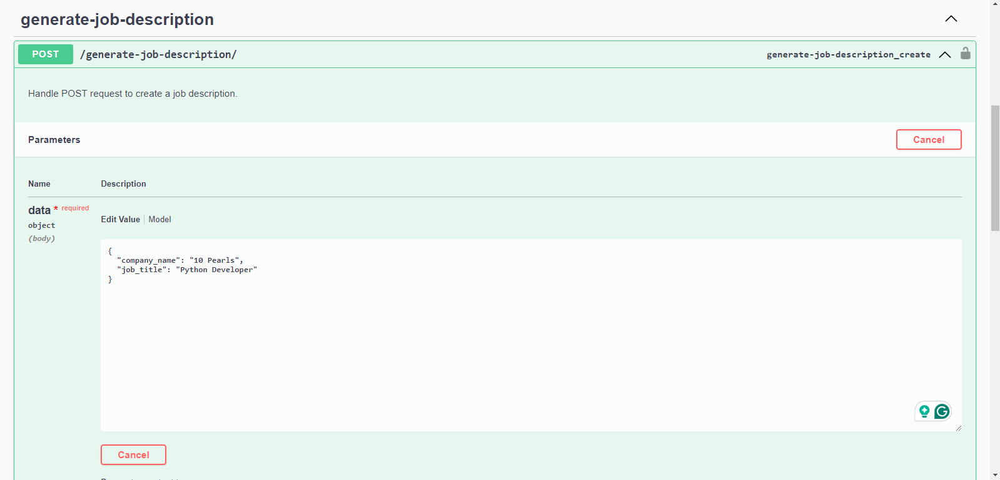
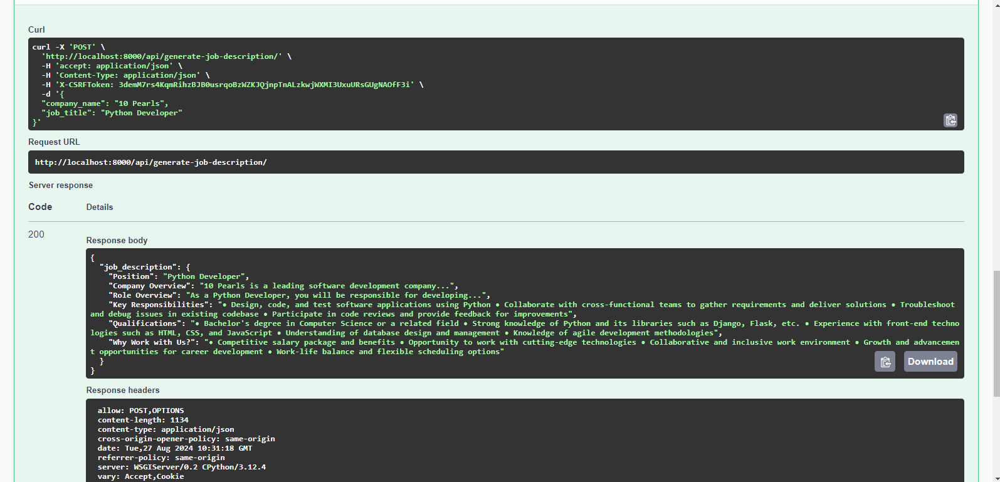

# AI Job Description Generator
# Overview
The AI Job Description Generator is a Python-based web application developed using Django, LangChain, and OpenAI. This project leverages the power of Large Language Models (LLMs) to automatically generate tailored job descriptions based on specific requirements, streamlining the recruitment process and enhancing efficiency for HR teams and recruiters.

# Features
### Customizable Job Descriptions:
Generate detailed and specific job descriptions by providing relevant inputs such as job title, required skills, experience level, and more.
### AI-Powered Suggestions:
Utilizes OpenAI's advanced language models to provide accurate and context-aware job descriptions.
#### Dynamic Data Handling:
Efficiently manages various job-related data inputs to produce relevant and precise descriptions.
#### Scalable and Extensible:
Designed to be easily extendable with additional features or integrated with other HR tools and platforms.
# Technology Stack
### Backend: Python, Django
### AI/ML: OpenAI API, LangChain
### Frontend: Django Templates
### Database: SQLite (default), can be configured to use PostgreSQL or any other relational database supported by Django.
### Environment Management: Virtualenv or Conda
# Installation
#### To set up the AI Job Description Generator locally, follow these steps:
##### 1. Clone the Repository:
###### git clone https://github.com/yourusername/ai-job-description-generator.git
###### cd ai-job-description-generator
##### 2. Create and Activate a Virtual Environment:
#### python -m venv env
#### source env/bin/activate   # On Windows, use `env\Scripts\activate`
##### 3. Install Dependencies:
##### pip install -r requirements.txt
#### 4. Set Up Environment Variables:
##### Create a .env file in the root directory of your project.
##### Add the following environment variables:
### env
###### OPENAI_API_KEY=your_openai_api_key
#### 5. Apply Migrations:
###### python manage.py migrate
##### 6. Run the Development Server:
###### python manage.py runserver
### Access the Application:
#### Open your browser and go to http://127.0.0.1:8000/swagger to start using the AI Job Description Generator.

# Usage
## Generate a Job Description:

### Navigate to the "Generate Job Description" page.
### Fill out the form with the necessary job details such as Company Name and Job Title.
### Click "Generate" to receive an AI-powered job description.
### Edit and Save Job Descriptions:
#### Once generated, the job description can be edited and customized further to fit specific needs.Save the finalized job description for future use or export it as needed.
# Contributing
#### We welcome contributions to enhance the functionality of this project. If you'd like to contribute, please follow these steps:
#Fork the repository.
### Create a new branch (git checkout -b feature/YourFeatureName).
### Make your changes and commit them (git commit -m 'Add some feature').
### Push to the branch (git push origin feature/YourFeatureName).
### Create a new Pull Request.
# License
### This project is licensed under the MIT License. See the LICENSE file for more details.
