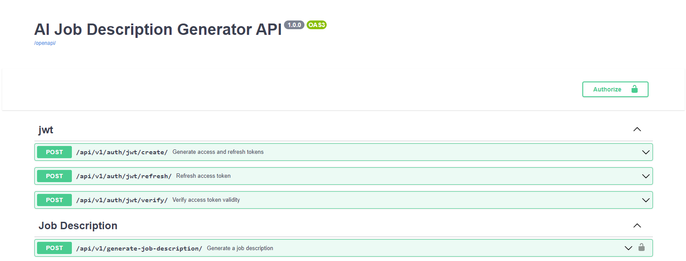
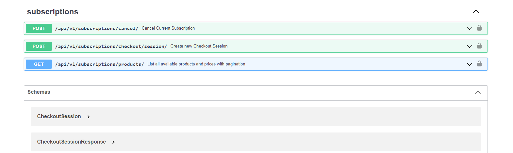

# AI Job Description Generator
# Overview
The AI Job Description Generator is a Python-based web application developed using Django, LangChain, and OpenAI. This project leverages the power of Large Language Models (LLMs) to automatically generate tailored job descriptions based on specific requirements, streamlining the recruitment process and enhancing efficiency for HR teams and recruiters.

 
